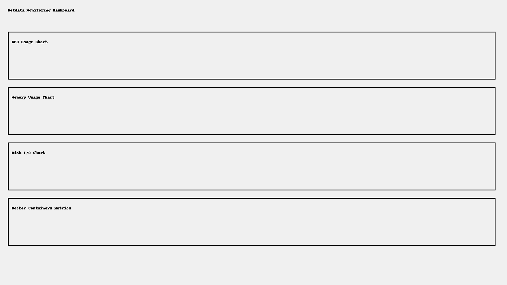

# Netdata Monitoring Dashboard

This project sets up Netdata for monitoring system metrics (CPU, memory, disk usage) and Docker containers using Docker.

## Setup

1. **Install Docker** on your machine (if not already installed).
2. Clone the repository or download the files.
3. Run the following Docker command to start the Netdata container:

```bash
docker run -d --name=netdata   -p 19999:19999   -v /var/run/docker.sock:/var/run/docker.sock:ro   --cap-add SYS_PTRACE   --security-opt apparmor=unconfined   netdata/netdata
```

4. Access the Netdata dashboard at `http://localhost:19999`.

## Screenshot


